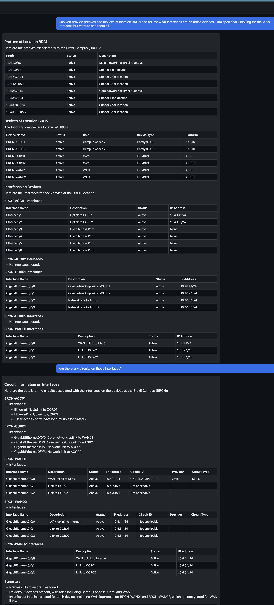

# Nautobot MCP Chat Interface

A self-contained, dockerized demo that exposes a **FastMCP** server for the Nautobot OSS platform, plus a lightweight **chat UI** that can list available MCP tools, call them, and export chat transcripts.



## 🚀 Version 2.0: Multi-Tool & Recursive Tool Calling

**Version 2.0 introduces advanced capabilities for concurrent tool execution and recursive tool chaining, enabling complex network analysis queries that automatically gather comprehensive data from multiple sources.**

### ✅ **Multi-Tool Execution**
- Execute multiple tools simultaneously for comprehensive data gathering
- Automatic coordination between different data sources
- Intelligent query planning and execution sequencing

### ✅ **Recursive Tool Chaining** 
- Results from one tool automatically inform subsequent tool calls
- Dynamic data-driven tool selection based on previous results
- Seamless chaining of related queries for deep analysis

### ✅ **Enhanced Data Presentation**
- Rich markdown formatting with tables and structured data
- Automatic highlighting of key information (WAN interfaces, circuits, etc.)
- Comprehensive analysis with network topology understanding

### ✅ **Real-Time Status Updates**
- Detailed progress tracking during tool execution
- Performance metrics and timing information
- Clear indication of processing stages and completion

### ✅ **Intelligent Context Management**
- Cached data reuse for follow-up questions
- Context-aware responses without redundant tool calls
- Smart analysis of previously gathered information

## 📋 Table of Contents

- [🚀 Quick Start](#-quick-start)
- [🎯 What's Included](#-whats-included)
- [🔧 Setup Steps](#-setup-steps)
  - [Step 1: Start Services](#step-1-start-services)
  - [Step 2: Configure Environment](#step-2-configure-environment)
  - [Step 3: Get OpenAI API Key](#step-3-get-openai-api-key)
  - [Step 4: Create Admin User](#step-4-create-admin-user)
  - [Step 5: Get Nautobot API Token](#step-5-get-nautobot-api-token)
  - [Step 6: Access Chat UI](#step-6-access-chat-ui)
- [🛠️ MCP Tools Available](#️-mcp-tools-available)
- [📊 Demo Data Structure](#-demo-data-structure)
- [💬 Example Queries](#-example-queries)
- [📤 Export Chat Transcripts](#-export-chat-transcripts)
- [🏗️ Architecture](#️-architecture)
- [🤝 Contributing New Tools](#-contributing-new-tools)
- [🔍 Troubleshooting](#-troubleshooting)

## 🚀 Quick Start

```bash
# 1. Start all services
docker-compose up -d

# 2. Copy environment file and configure
cp .env.example .env

# 3. Get OpenAI API key (required for chat functionality):
#    - Go to https://platform.openai.com/api-keys
#    - Create a new API key
#    - Add it to your .env file: OPENAI_API_KEY=your_openai_api_key_here

# 4. Create admin user
docker exec -it nautobot_mcp-1-nautobot-1 nautobot-server createsuperuser --username admin --email admin@example.com

# 5. Get your Nautobot API token:
#    - Go to http://localhost:8080 and log in with your username and password
#    - Navigate to your User Profile → API Tokens → Add token
#    - Copy the token key and update your .env file: NAUTOBOT_TOKEN=your_api_token_here
#    - Restart the services: docker-compose restart

# 6. Open the chat UI
#    http://localhost:8501
```

## 🎯 What's Included

- **Nautobot** with seeded demo data and GraphQL enabled
- **FastMCP Server** exposing Nautobot utilities as MCP tools
- **Chat UI** for testing MCP tools and exporting conversations
- **Demo Data** including locations, devices, interfaces, and IPAM

## 🔧 Setup Steps

### Step 1: Start Services
```bash
docker-compose up -d
```

### Step 2: Configure Environment
```bash
cp .env.example .env
```

### Step 3: Get OpenAI API Key
1. Go to https://platform.openai.com/api-keys
2. Create a new API key
3. Add it to your `.env` file:
   ```bash
   OPENAI_API_KEY=your_openai_api_key_here
   ```
   **Note**: This is required for chat functionality to work properly.

### Step 4: Create Admin User
```bash
docker exec -it nautobot_mcp-nautobot-1 nautobot-server createsuperuser --username admin --email admin@example.com
```

### Step 5: Get Nautobot API Token
1. Go to http://localhost:8080 and log in
2. Navigate to **User Profile** → **API Tokens** → **Add token**
3. Copy the token and update your `.env` file:
   ```bash
   NAUTOBOT_TOKEN=your_api_token_here
   ```
4. Restart services:
   ```bash
   docker-compose restart
   ```

### Step 6: Access Chat UI
Open http://localhost:8501 in your browser

## 🛠️ MCP Tools Available

1. **`get_prefixes_by_location_enhanced`** - Query prefixes by location with format options
2. **`get_devices_by_location`** - Get devices at a specific location
3. **`get_devices_by_location_and_role`** - Get devices by location and role
4. **`get_interfaces_by_device`** - Get interfaces, IP addresses, and circuit information for a device
5. **`get_circuits_by_location`** - Get circuits for specific locations
6. **`get_circuits_by_provider`** - Get circuits for specific providers
7. **`get_locations`** - Get all available locations with hierarchy information
8. **`get_providers`** - Get all available circuit providers
9. **Dynamic Tool Discovery** - Chat UI automatically discovers and presents available tools

## 📊 Demo Data Structure

The system includes a comprehensive network topology:

- **Locations**: Regions → Countries → Campuses/Branches/Data Centers
- **Devices**: WAN routers, core routers, access switches, spine/leaf switches
- **Interfaces**: Properly configured with VLANs and IP addressing
- **IPAM**: Prefixes associated with locations and interfaces

## 💬 Example Queries

Try these in the chat UI:

### **Basic Location Queries (Use exact location codes only):**
- "What prefixes exist at NYDC?"
- "Show me all devices at BRCN"
- "List devices at USBN1"
- "What's at LODC?"

### **Discovery Queries:**
- "What locations are available in the system?"
- "Show me all circuit providers"
- "List all available locations with their countries and regions"

### **Circuit Queries:**
- "Give me a list of circuits at location BRCN"
- "Show me all circuits at NYDC and DACN"
- "What circuits are available at LODC?"
- "List all circuits at USBN1 and USBN2"
- "Show me all circuits from provider Zayo"
- "What circuits does AT&T provide?"
- "List all circuits from Level 3"

### **Device Role Queries:**
- "Show me all WAN routers at NYDC"
- "List all Spine switches at LODC"
- "What Leaf switches are at BRCN?"
- "Show me all Branch Access switches at USBN1"
- "List Core routers at DACN"
- "What Campus Access switches are at MXCN?"

### **Interface Queries:**
- "What interfaces are on BRCN-WAN01?"
- "Show me all interfaces on NYDC-CORE-01"
- "List interfaces on DACN-ACC01"
- "What are the WAN interfaces on LODC-SPINE-01?"

### **Complex Analysis Queries (Version 2.0 - Multi-Tool & Recursive):**

#### **Concurrent Tool Execution:**
- "Can you provide prefixes and devices at location BRCN and tell me what interfaces are on those devices?"
- "Show me all devices at NYDC and their interface configurations"
- "What are the WAN interfaces at LODC and their circuit information?"
- "Get all devices at USBN1 and show me their interfaces with IP addresses"

#### **Recursive Tool Chaining:**
- "Show me all WAN routers at BRCN and then get the interfaces for each one"
- "List all Core devices at NYDC and show me their interface details"
- "Get all devices at DACN, then show me the interfaces for each device"
- "Find all WAN routers at LODC and display their interface configurations"

#### **Cross-Location Analysis:**
- "Compare the WAN routers at BRCN and NYDC - show me their interfaces and circuits"
- "Get all Core devices at DACN and LODC and show their interface configurations"
- "Show me all circuits at BRCN, NYDC, and DACN"
- "Compare the network topology between USBN1 and USBN2 - devices, interfaces, and circuits"

#### **Advanced Network Analysis:**
- "Analyze the network at BRCN: show me prefixes, devices, interfaces, and circuits"
- "Give me a complete network overview of NYDC including all devices, their interfaces, and any circuits"
- "Show me the full network topology at DACN with devices, interfaces, IP addresses, and circuits"
- "Provide a comprehensive analysis of the LODC network including all network components"

#### **Discovery-Based Analysis:**
- "First show me all available locations, then analyze the network at the largest campus"
- "List all providers and then show me circuits from the most common provider"
- "What locations are available and which ones have the most devices?"
- "Show me all providers and then get circuits from each one"
- "First discover available locations, then get devices and circuits for each data center"

#### **Troubleshooting Queries:**
- "What circuits are connected to WAN interfaces at BRCN?"
- "Show me all interfaces with IP addresses at NYDC"
- "List all devices at DACN that have circuit connections"
- "Find all WAN routers at LODC and show their circuit information"

## 📤 Export Chat Transcripts

The chat UI can export conversations in:
- **JSON format** - Complete conversation with tool call metadata
- **Markdown format** - Readable log with tool call details

## 🏗️ Architecture

```
+-------------------+         +-------------------+       +------------------+
|  Chat UI         | <-----> |  MCP Client SDK   | <-->  |  FastMCP Server  |
|  (Flask/HTML)    |         |  (tool catalog)   |       |  (Nautobot tools)|
+-------------------+         +-------------------+       +--------+---------+
                                                                     |
                                                                     v
                                                             +---------------+
                                                             |   Nautobot    |
                                                             | (GraphQL API) |
                                                             +---------------+
```

## 🤝 Contributing New Tools

To add new MCP tools to the server:

### **1. Add Tool Function**
Create your tool function in `services/mcp-nautobot/mcp_server/tools/` directory.

### **2. Register Tool in Server**
Add the tool to `services/mcp-nautobot/mcp_server/server.py`:

```python
# Create Tool instance
my_tool = Tool.from_function(
    fn=my_tool_function,
    name="my_tool_name",
    description="""Detailed description of what the tool does.

        Args:
            param1: Description of parameter 1
            param2: Description of parameter 2

        Returns:
            Description of what the tool returns
        """
)

# Add to server
server.add_tool(my_tool)
```

### **3. Tool Descriptions & LLM Communication**
The `description` field is crucial - it's what the LLM reads to understand:
- **What the tool does**
- **What parameters it accepts**
- **What it returns**
- **Example values and formats**

The LLM uses this description to decide when and how to call your tool. Be specific and include examples!

## 🔍 Troubleshooting

### **General Issues**
- **Services not starting**: Check `docker-compose logs` for errors
- **Chat UI not loading**: Ensure all services are healthy with `docker-compose ps`
- **API errors**: Verify your `NAUTOBOT_TOKEN` is set correctly in `.env`

### **Seed Data Issues**

If you're not seeing data in your queries, the seed container may have failed:

1. **Check seed container logs:**
   ```bash
   docker-compose logs seed-data
   ```

2. **Look for common seed errors:**
   - Connection timeouts to Nautobot
   - Authentication failures
   - Database constraint violations
   - Missing dependencies

3. **Rerun seed container if needed:**
   ```bash
   # Stop and remove the seed container
   docker-compose rm -f seed-data
   
   # Restart it to rerun the seeding process
   docker-compose up -d seed-data
   
   # Check logs again
   docker-compose logs -f seed-data
   ```

4. **Verify data was created:**
   - Go to http://localhost:8080 and log into Nautobot
   - Check that locations, devices, and prefixes exist
   - If no data exists, the seed process failed

5. **Common seed container issues:**
   - **Nautobot not ready**: Seed container starts before Nautobot is fully initialized
   - **Network connectivity**: Container can't reach Nautobot API
   - **Permission issues**: API token doesn't have sufficient permissions
   - **Database locks**: Concurrent operations causing conflicts

## 📝 License

Apache-2.0
